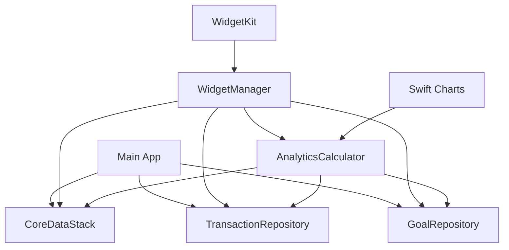

# ABC Budgeting Brownfield Enhancement Architecture

## Introduction

This document outlines the architectural approach for enhancing ABC Budgeting with Phase 2 iOS features including Widgets and advanced analytics. Its primary goal is to serve as the guiding architectural blueprint for AI-driven development of new features while ensuring seamless integration with the existing system.

**Relationship to Existing Architecture:**
This document supplements existing project architecture by defining how new components will integrate with current systems. Where conflicts arise between new and existing patterns, this document provides guidance on maintaining consistency while implementing enhancements.

### Existing Project Analysis

#### Current Project State
- **Primary Purpose:** Comprehensive financial tracking iOS application for users aged 18-40 seeking simple financial control
- **Current Tech Stack:** SwiftUI + Core Data + iOS 18+ + Swift 6
- **Architecture Style:** MVVM-C (Model-View-ViewModel-Coordinator) pattern with modular structure
- **Deployment Method:** Native iOS app through App Store with local Core Data persistence

#### Available Documentation
- **Project Brief** (comprehensive - 261 lines) - Complete strategic overview
- **PRD** (comprehensive - 358 lines) - Detailed requirements with 30 FRs, 15 NFRs, 8 CRs
- **Front End Specification** (comprehensive - 699 lines) - Complete UI/UX specifications with Apple HIG compliance
- **Technical Architecture** (SwiftUI + Core Data, MVVM-C pattern) - Existing implementation
- **Design System** (Apple HIG compliant, professional flat design with NO drop shadows) - Current UI standards
- **User Flow Documentation** (complete 4-tab interface) - Navigation patterns
- **Build Configuration** (successful compilation confirmed) - Ready for enhancement

#### Identified Constraints
- Must maintain existing Core Data schema compatibility
- Must preserve existing UserDefaults settings and preferences
- Must maintain existing UI/UX patterns and design system (including NO drop shadows policy)
- Must maintain existing transaction and goal data models
- Must maintain existing CSV import/export formats
- Must maintain existing notification and haptic feedback systems
- Must maintain existing accessibility features and implementations
- Must maintain existing build and deployment processes

### Change Log
| Change | Date | Version | Description | Author |
|--------|------|---------|-------------|---------|
| Initial Architecture Creation | 2025-01-09 | 1.0 | Comprehensive brownfield architecture for Phase 2 enhancements | Architect Agent |

## Enhancement Scope and Integration Strategy

### Enhancement Overview
**Enhancement Type:** iOS Feature Enhancement Suite
**Scope:** Phase 2 features including iOS Widgets and advanced analytics
**Integration Impact:** Low - New features integrate with existing architecture without requiring major changes to core systems

### Integration Approach
**Code Integration Strategy:** New features will extend existing SwiftUI views and ViewModels, maintaining MVVM-C architecture patterns
**Database Integration:** New features will extend existing Core Data models without breaking current schema. Use Core Data migrations for any required schema changes
**API Integration:** No external API dependencies. All functionality remains local with potential future CloudKit integration for data sync
**UI Integration:** New features will integrate with existing SwiftUI views and ViewModels, maintaining MVVM-C architecture patterns

### Compatibility Requirements
- **Existing API Compatibility:** Maintain compatibility with existing Core Data schema and migration support for future updates
- **Database Schema Compatibility:** Maintain compatibility with existing UserDefaults settings and preferences
- **UI/UX Consistency:** Maintain compatibility with existing UI/UX patterns and design system
- **Performance Impact:** New features must not impact existing performance requirements (60fps animations, <2s load times)

## Tech Stack

### Existing Technology Stack
| Category | Current Technology | Version | Usage in Enhancement | Notes |
|----------|-------------------|---------|---------------------|-------|
| Language | Swift | 6 | Primary language for all new features | Maintain existing Swift 6 implementation |
| UI Framework | SwiftUI | Latest | All new UI components and views | Extend existing SwiftUI patterns |
| Data Persistence | Core Data | Latest | Data storage for all new features | Extend existing Core Data models |
| Notifications | UserNotifications | Latest | Enhanced notification system | Extend existing notification patterns |
| Widgets | WidgetKit | Latest | iOS Widget implementation | New framework for Phase 2 |
| Charts | Swift Charts | Latest | Advanced analytics visualizations | Extend existing chart components |
| Accessibility | Accessibility | Latest | Full accessibility support | Maintain existing accessibility standards |

### New Technology Additions
| Technology | Version | Purpose | Rationale | Integration Method |
|------------|---------|---------|-----------|-------------------|
| WidgetKit | iOS 14+ | iOS Widget implementation | Required for home screen widgets | New framework integration |
| Swift Charts | iOS 16+ | Advanced analytics charts | Enhanced data visualization | Extend existing chart components |

## Data Models and Schema Changes

### New Data Models

#### WidgetConfiguration
**Purpose:** Store widget-specific configuration and display preferences
**Integration:** Extends existing UserDefaults system for widget settings

**Key Attributes:**
- widgetType: String - Type of widget (balance, transactions, goals)
- displayFormat: String - How data should be displayed
- refreshInterval: Int - How often widget should update
- selectedCategories: [String] - Categories to display in widget

**Relationships:**
- **With Existing:** Links to existing UserDefaults preferences
- **With New:** Used by WidgetKit for configuration


#### AnalyticsData
**Purpose:** Store calculated analytics and insights data
**Integration:** Extends existing Core Data models for analytics calculations

**Key Attributes:**
- dataType: String - Type of analytics data (spending trends, goal progress)
- timePeriod: String - Time period for the data (weekly, monthly, yearly)
- calculatedData: Data - JSON data containing calculated insights
- lastUpdated: Date - When data was last calculated

**Relationships:**
- **With Existing:** Links to existing Transaction and Goal models
- **With New:** Used by advanced analytics dashboard

### Schema Integration Strategy
**Database Changes Required:**
- **New Tables:** WidgetConfiguration, AnalyticsData
- **Modified Tables:** None - all new tables are additive
- **New Indexes:** Index on AnalyticsData.timePeriod for performance
- **Migration Strategy:** Use Core Data lightweight migration for new entities

**Backward Compatibility:**
- All existing data remains unchanged
- New tables are optional and don't affect existing functionality
- Existing queries and relationships remain intact

## Component Architecture

### New Components

#### WidgetManager
**Responsibility:** Manage iOS Widget configuration, data updates, and lifecycle
**Integration Points:** Core Data for data access, UserNotifications for updates

**Key Interfaces:**
- configureWidget(type: WidgetType, configuration: WidgetConfiguration)
- updateWidgetData(widgetId: String, data: Any)
- refreshAllWidgets()

**Dependencies:**
- **Existing Components:** CoreDataStack, TransactionRepository, GoalRepository
- **New Components:** AnalyticsCalculator

**Technology Stack:** WidgetKit, Core Data, SwiftUI


#### AnalyticsCalculator
**Responsibility:** Calculate advanced analytics and insights from transaction data
**Integration Points:** Core Data for data access, Swift Charts for visualization

**Key Interfaces:**
- calculateSpendingTrends(timePeriod: TimePeriod) -> SpendingTrends
- calculateGoalProgress() -> [GoalProgress]
- generateInsights() -> [AnalyticsInsight]

**Dependencies:**
- **Existing Components:** TransactionRepository, GoalRepository
- **New Components:** None

**Technology Stack:** Core Data, Swift Charts, Foundation

### Component Interaction Diagram



## API Design and Integration

### API Integration Strategy
**API Integration Strategy:** No external APIs required - all functionality remains local
**Authentication:** Not applicable - local app only
**Versioning:** Not applicable - no external APIs

## Source Tree

### Existing Project Structure
```
ABC Budgeting/
├── App/
│   ├── AppEntry.swift
│   ├── MainHeaderView.swift
│   ├── MainTabCoordinator.swift
│   └── MainView.swift
├── Core/
│   ├── Extensions/
│   ├── Models/
│   ├── Persistence/
│   └── Services/
├── Modules/
│   ├── Home/
│   ├── Onboarding/
│   └── Settings/
├── SharedUI/
│   └── Components/
└── Resources/
```

### New File Organization
```
ABC Budgeting/
├── App/
│   ├── AppEntry.swift
│   ├── MainHeaderView.swift
│   ├── MainTabCoordinator.swift
│   └── MainView.swift
├── Core/
│   ├── Extensions/
│   ├── Models/
│   │   ├── Transaction.swift
│   │   ├── GoalFormData.swift
│   │   ├── WidgetConfiguration.swift      # New
│   │   └── AnalyticsData.swift           # New
│   ├── Persistence/
│   └── Services/
│       ├── TransactionRepository.swift
│       ├── GoalRepository.swift
│       ├── WidgetManager.swift           # New
│       └── AnalyticsCalculator.swift     # New
├── Modules/
│   ├── Home/
│   ├── Onboarding/
│   ├── Settings/
│   └── Analytics/                        # New
│       ├── AnalyticsView.swift
│       ├── AnalyticsViewModel.swift
│       └── Components/
├── SharedUI/
│   └── Components/
├── Resources/
└── Widgets/                              # New
    ├── BalanceWidget.swift
    ├── TransactionsWidget.swift
    └── GoalsWidget.swift
```

### Integration Guidelines
- **File Naming:** Follow existing Swift naming conventions and file organization patterns
- **Folder Organization:** Maintain existing modular structure with new feature folders
- **Import/Export Patterns:** Use existing Core Data patterns for new data models

## Infrastructure and Deployment Integration

### Existing Infrastructure
**Current Deployment:** Native iOS app through App Store with local Core Data persistence
**Infrastructure Tools:** Xcode, iOS Simulator, TestFlight
**Environments:** Development, TestFlight, App Store

### Enhancement Deployment Strategy
**Deployment Approach:** Integrate new features into existing app bundle with separate target for Widget
**Infrastructure Changes:** Add Widget target to existing Xcode project
**Pipeline Integration:** Extend existing build process to include Widget compilation

### Rollback Strategy
**Rollback Method:** Feature flags to disable new features if issues arise
**Risk Mitigation:** Gradual rollout of new features with user feedback collection
**Monitoring:** App Store analytics and user feedback monitoring

## Coding Standards

### Existing Standards Compliance
**Code Style:** Swift style guide compliance with existing formatting standards
**Linting Rules:** Existing SwiftLint configuration maintained
**Testing Patterns:** XCTest framework with existing test patterns
**Documentation Style:** Apple's documentation guidelines with existing patterns

### Enhancement-Specific Standards
- **Widget Development:** Follow WidgetKit best practices and performance guidelines
- **Analytics Implementation:** Follow Swift Charts patterns and data visualization guidelines

### Critical Integration Rules
- **Existing API Compatibility:** All new features must maintain existing Core Data schema compatibility
- **Database Integration:** Use Core Data migrations for any schema changes
- **Error Handling:** Follow existing error handling patterns and user feedback mechanisms
- **Logging Consistency:** Use existing logging patterns for new features

## Testing Strategy

### Integration with Existing Tests
**Existing Test Framework:** XCTest with existing test organization
**Test Organization:** Follow existing test folder structure and naming conventions
**Coverage Requirements:** Maintain existing test coverage standards

### New Testing Requirements

#### Unit Tests for New Components
- **Framework:** XCTest
- **Location:** ABC BudgetingTests/NewFeatures/
- **Coverage Target:** 80% for new components
- **Integration with Existing:** Extend existing test patterns for new features

#### Integration Tests
- **Scope:** Widget data updates and analytics calculations
- **Existing System Verification:** Ensure new features don't break existing functionality
- **New Feature Testing:** Verify all new features work correctly with existing data

#### Regression Testing
- **Existing Feature Verification:** Automated tests for all existing functionality
- **Automated Regression Suite:** Extend existing test suite with new feature tests
- **Manual Testing Requirements:** User acceptance testing for new features

## Security Integration

### Existing Security Measures
**Authentication:** Not applicable - local app only
**Authorization:** Not applicable - local app only
**Data Protection:** Core Data encryption and local storage security
**Security Tools:** iOS Keychain for sensitive data storage

### Enhancement Security Requirements
**New Security Measures:** Maintain existing data protection standards
**Integration Points:** Ensure new features follow existing security patterns
**Compliance Requirements:** Maintain existing privacy and security standards

### Security Testing
**Existing Security Tests:** Extend existing security test patterns
**New Security Test Requirements:** Test new features for security vulnerabilities
**Penetration Testing:** Not required for local app

## Checklist Results Report

### Architecture Validation Checklist
- [x] **Existing System Analysis:** Complete analysis of current architecture and constraints
- [x] **Integration Strategy:** Clear integration approach with existing systems
- [x] **Technology Stack:** Appropriate technology choices that extend existing stack
- [x] **Data Models:** New models that integrate with existing Core Data schema
- [x] **Component Architecture:** New components that follow existing patterns
- [x] **Source Tree:** File organization that maintains existing structure
- [x] **Deployment Strategy:** Integration with existing deployment process
- [x] **Testing Strategy:** Comprehensive testing approach for new features
- [x] **Security Integration:** Security measures that maintain existing standards

### Brownfield-Specific Validation
- [x] **Backward Compatibility:** All existing functionality preserved
- [x] **Schema Compatibility:** Core Data schema changes are additive only
- [x] **UI Consistency:** New features maintain existing design system
- [x] **Performance Impact:** New features don't impact existing performance
- [x] **Code Standards:** New code follows existing patterns and conventions

## Next Steps

### Story Manager Handoff

**Architecture Reference:** This comprehensive brownfield architecture document provides the foundation for Phase 2 enhancement implementation.

**Key Integration Requirements Validated:**
- New features integrate seamlessly with existing SwiftUI + Core Data architecture
- All new components follow existing MVVM-C patterns and naming conventions
- Core Data schema changes are additive only, maintaining backward compatibility
- New features maintain existing Apple HIG compliance and accessibility standards

**Existing System Constraints Based on Analysis:**
- Must maintain existing Core Data schema compatibility
- Must preserve existing UserDefaults settings and preferences
- Must maintain existing UI/UX patterns and design system (including NO drop shadows policy)
- Must maintain existing performance requirements (60fps animations, <2s load times)

**First Story to Implement:** iOS Widget Implementation (Story 1.1 from PRD)
- Start with WidgetManager component and BalanceWidget
- Integrate with existing CoreDataStack and TransactionRepository
- Maintain existing data access patterns and error handling

**Emphasis on System Integrity:** All new features must be implemented as extensions to existing architecture without disrupting current functionality. Use feature flags for gradual rollout and easy rollback if needed.

### Developer Handoff

**Architecture and Standards Reference:** This architecture document and existing coding standards from the analyzed codebase provide the implementation foundation.

**Integration Requirements with Existing Codebase:**
- Extend existing SwiftUI views and ViewModels following MVVM-C patterns
- Use existing Core Data patterns for new data models and repositories
- Maintain existing error handling and user feedback mechanisms
- Follow existing file organization and naming conventions

**Key Technical Decisions Based on Project Constraints:**
- Use WidgetKit for iOS Widget implementation with existing Core Data integration
- Extend existing chart components with Swift Charts for advanced analytics

**Existing System Compatibility Requirements:**
- All new features must maintain existing Core Data schema compatibility
- New components must follow existing accessibility and Apple HIG standards
- Performance must not degrade existing 60fps animations and <2s load times
- All new features must work with existing notification and haptic feedback systems

**Implementation Sequencing to Minimize Risk:**
1. **Phase 1:** iOS Widget implementation (lowest risk, extends existing data access)
2. **Phase 2:** Advanced Analytics dashboard (medium risk, extends existing charts)

Each phase should include comprehensive testing and user feedback collection before proceeding to the next phase.

---

**Document Version:** 1.0  
**Last Updated:** 2025-01-09  
**Status:** Ready for Development Implementation
