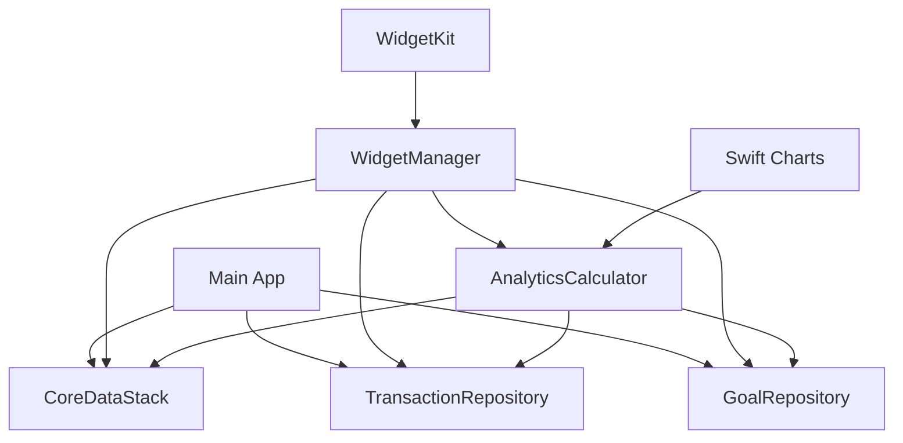

# Component Architecture

## New Components

### WidgetManager
**Responsibility:** Manage iOS Widget configuration, data updates, and lifecycle
**Integration Points:** Core Data for data access, UserNotifications for updates

**Key Interfaces:**
- configureWidget(type: WidgetType, configuration: WidgetConfiguration)
- updateWidgetData(widgetId: String, data: Any)
- refreshAllWidgets()

**Dependencies:**
- **Existing Components:** CoreDataStack, TransactionRepository, GoalRepository
- **New Components:** AnalyticsCalculator

**Technology Stack:** WidgetKit, Core Data, SwiftUI

### AnalyticsCalculator
**Responsibility:** Calculate advanced analytics and insights from transaction data
**Integration Points:** Core Data for data access, Swift Charts for visualization

**Key Interfaces:**
- calculateSpendingTrends(timePeriod: TimePeriod) -> SpendingTrends
- calculateGoalProgress() -> [GoalProgress]
- generateInsights() -> [AnalyticsInsight]

**Dependencies:**
- **Existing Components:** TransactionRepository, GoalRepository
- **New Components:** None

**Technology Stack:** Core Data, Swift Charts, Foundation

## Component Interaction Diagram

