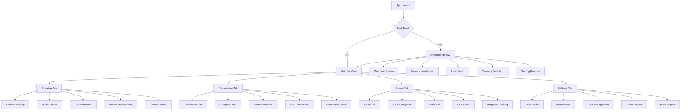
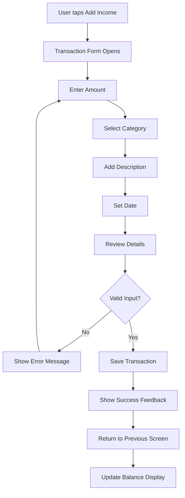
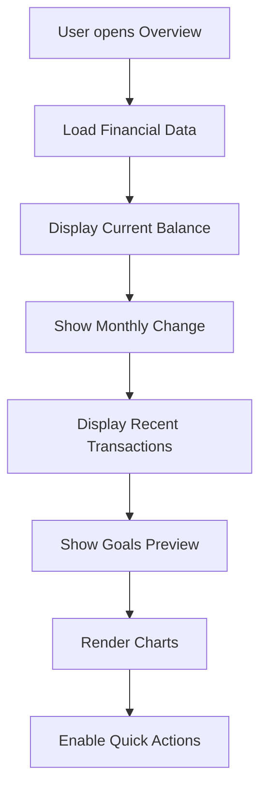
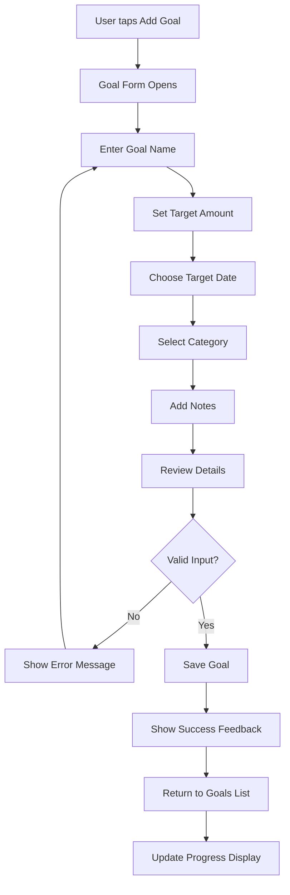

# ABC Budgeting UI/UX Specification

## Introduction

This document defines the user experience goals, information architecture, user flows, and visual design specifications for ABC Budgeting's user interface. It serves as the foundation for visual design and frontend development, ensuring a cohesive and user-centered experience.

### Overall UX Goals & Principles

#### Target User Personas

**Primary User: Personal Finance Tracker (Ages 18-40)**
- **Demographics**: 18-40 years old, various income levels, mobile-first users
- **Tech Comfort**: Comfortable with mobile apps, prefer simple interfaces
- **Financial Goals**: Better control over spending, clear financial visibility, effective savings management
- **Pain Points**: Need integrated expense/goal tracking, want professional tools without complexity
- **Behavioral Patterns**: Use mobile apps for daily financial activities, value clean design, need actionable insights

#### Usability Goals

- **Ease of Learning**: New users can complete core tasks (add transaction, view balance) within 2 minutes
- **Efficiency of Use**: Power users can add transactions in under 30 seconds
- **Error Prevention**: Clear validation and confirmation for all financial actions
- **Memorability**: Infrequent users can return without relearning basic navigation
- **Accessibility**: Full VoiceOver support and Dynamic Type compatibility
- **Performance**: Smooth 60fps animations with sub-2-second load times

#### Design Principles

1. **Clarity over Cleverness** - Prioritize clear financial communication over aesthetic innovation
2. **Progressive Disclosure** - Show only essential information, reveal details on demand
3. **Consistent Patterns** - Use familiar iOS patterns throughout the application
4. **Immediate Feedback** - Every financial action must have clear, immediate visual response
5. **Accessible by Default** - Design for all users from the start with full accessibility support
6. **Professional Simplicity** - Banking-app-quality design with flat, clean aesthetics **without drop shadows**

### Change Log
| Date | Version | Description | Author |
|------|---------|-------------|---------|
| 2025-01-09 | 1.0 | Initial comprehensive UI/UX specification | UX Expert |

## Information Architecture (IA)

### Site Map / Screen Inventory

### Navigation Structure

**Primary Navigation:** Four-tab bottom navigation (Overview, Transactions, Budget, Settings) with consistent iconography and labels

**Secondary Navigation:** Contextual navigation within each tab using standard iOS navigation patterns (NavigationStack, sheets, alerts)

**Breadcrumb Strategy:** Not applicable for mobile app - use clear page titles and back navigation

## User Flows

### Flow 1: Add Income Transaction

**User Goal:** Quickly add an income transaction to track money received

**Entry Points:** Overview tab "Add Income" button, Transactions tab "+" button

**Success Criteria:** Transaction appears in list with correct amount, category, and date

#### Flow Diagram

#### Edge Cases & Error Handling
- **Invalid Amount**: Show error message "Please enter a valid amount"
- **Empty Description**: Auto-generate description from category
- **Network Error**: Show retry option with offline capability
- **Duplicate Transaction**: Warn user about potential duplicate

**Notes:** Form uses modal presentation with clear validation feedback

### Flow 2: View Financial Overview

**User Goal:** Get quick understanding of current financial status

**Entry Points:** App launch, Overview tab selection, widget tap

**Success Criteria:** User sees current balance, recent activity, and goal progress

#### Flow Diagram

#### Edge Cases & Error Handling
- **No Data**: Show empty state with onboarding prompts
- **Loading Error**: Show retry button with error message
- **Slow Performance**: Show loading indicators for charts

**Notes:** All data loads asynchronously with progressive disclosure

### Flow 3: Create Savings Goal

**User Goal:** Set up a new savings goal with target amount and timeline

**Entry Points:** Budget tab "+" button, Overview tab "See All Goals" button

**Success Criteria:** Goal appears in list with progress tracking enabled

#### Flow Diagram

#### Edge Cases & Error Handling
- **Invalid Date**: Show error "Target date must be in the future"
- **Invalid Amount**: Show error "Target amount must be greater than $0"
- **Duplicate Name**: Suggest alternative name or allow edit

**Notes:** Form includes progress calculation preview

## Wireframes & Mockups

### Design Files
**Primary Design Files:** SwiftUI code-based design system (no external design files)

### Key Screen Layouts

#### Overview Tab
**Purpose:** Central dashboard showing financial status and quick actions

**Key Elements:**
- Balance display with monthly change indicator
- Two quick action buttons (Add Income, Add Expense)
- Goals preview section with "See All" button
- Recent transactions section with "See All" button
- Interactive charts (income breakdown, required income)

**Interaction Notes:** All sections are tappable for navigation to detailed views

#### Transactions Tab
**Purpose:** Complete transaction management with filtering and search

**Key Elements:**
- Total transaction count header
- Category carousel (All, Essentials, Leisure, etc.)
- Search bar with real-time filtering
- Transaction list with swipe actions
- Floating action button for adding transactions

**Interaction Notes:** Swipe left for edit/delete, pull to refresh, infinite scroll

#### Budget Tab
**Purpose:** Savings goals management and progress tracking

**Key Elements:**
- Goals list with progress indicators
- Category filters (Personal, Loan Payoff)
- Goal cards showing target amount, saved amount, progress percentage
- Floating action button for adding goals

**Interaction Notes:** Tap goal cards for detailed view, swipe for quick actions

#### Settings Tab
**Purpose:** User preferences and data management

**Key Elements:**
- User profile section (name, avatar)
- Preferences (notifications, haptics, currency)
- Data management (import/export, clear data)
- About section (version, support)

**Interaction Notes:** Toggle switches for preferences, confirmation dialogs for destructive actions

## Component Library / Design System

### Design System Approach
**Design System Approach:** Custom SwiftUI-based design system with mathematical precision, following Apple's Human Interface Guidelines with NO drop shadows allowed

### Core Components

#### AppButton
**Purpose:** Primary and secondary action buttons throughout the app

**Variants:** Primary, Secondary, Destructive, Small, Large, Tiny

**States:** Normal, Pressed, Disabled, Loading

**Usage Guidelines:**
- Primary buttons for main actions (Add Transaction, Save Goal)
- Secondary buttons for alternative actions (Cancel, Edit)
- Destructive buttons for dangerous actions (Delete, Clear Data)
- Use consistent sizing: Height 44pt (standard), 52pt (large), 36pt (small), 28pt (tiny)

#### AppCard
**Purpose:** Container for related content with consistent styling

**Variants:** Standard, Large, Small, Elevated

**States:** Normal, Pressed, Selected

**Usage Guidelines:**
- Use for goal cards, transaction items, and content sections
- Standard height: 120pt, padding: 16pt
- Border radius: 12pt
- **NO SHADOWS**: Use flat design with subtle borders instead of shadows

#### AppInputField
**Purpose:** Text input with validation and consistent styling

**Variants:** Standard, Large, Small, Search

**States:** Normal, Focused, Error, Disabled

**Usage Guidelines:**
- Height: 44pt (standard), 52pt (large), 36pt (small)
- Padding: 12pt horizontal, 12pt vertical
- Border radius: 8pt

#### DonutChartView
**Purpose:** Interactive circular chart for data visualization

**Variants:** Standard, Large, Small, Animated

**States:** Normal, Selected, Loading

**Usage Guidelines:**
- Use for spending category breakdowns
- Standard size: 200pt diameter
- Include accessibility labels and VoiceOver support

## Branding & Style Guide

### Visual Identity
**Brand Guidelines:** Professional flat design with banking-app-quality aesthetics

### Color Palette
| Color Type | Hex Code | Usage |
|------------|----------|-------|
| Primary | #2563EB | Primary buttons, links, active states |
| Primary Dark | #1D4ED8 | Pressed states, hover effects |
| Secondary | #059669 | Success states, income indicators |
| Accent | #7C3AED | Accent elements, savings goals |
| Success | #059669 | Positive feedback, confirmations |
| Warning | #D97706 | Cautions, important notices |
| Error | #DC2626 | Errors, destructive actions |
| Background | #FAFAFA | Main background color |
| Card | #FFFFFF | Card backgrounds, modals |
| Text Primary | #111827 | Main text, headings |
| Text Secondary | #6B7280 | Secondary text, labels |
| Text Tertiary | #9CA3AF | Tertiary text, placeholders |

### Typography

#### Font Families
- **Primary:** SF Pro Display (iOS system font)
- **Secondary:** SF Pro Text (iOS system font)
- **Monospace:** SF Mono (for numerical data)

#### Type Scale
| Element | Size | Weight | Line Height |
|---------|------|--------|-------------|
| H1 | 28pt | Bold | 36pt |
| H2 | 24pt | Bold | 32pt |
| H3 | 20pt | Semibold | 28pt |
| H4 | 18pt | Semibold | 24pt |
| H5 | 16pt | Semibold | 22pt |
| H6 | 14pt | Semibold | 20pt |
| Body Large | 18pt | Regular | 26pt |
| Body | 16pt | Regular | 24pt |
| Body Small | 14pt | Regular | 20pt |
| Body Tiny | 12pt | Regular | 18pt |
| Button | 16pt | Semibold | 22pt |
| Caption | 12pt | Regular | 18pt |

### Iconography
**Icon Library:** SF Symbols (iOS system icons)

**Usage Guidelines:**
- Use consistent icon sizes: 16pt (small), 20pt (medium), 24pt (large), 32pt (extra large)
- Maintain 2pt stroke weight for consistency
- Use semantic colors for different contexts

### Spacing & Layout
**Grid System:** 4pt base unit with consistent spacing scale

**Spacing Scale:**
- xs: 4pt, sm: 8pt, md: 12pt, lg: 16pt, xl: 20pt, xxl: 24pt, xxxl: 32pt
- Screen padding: 20pt (standard), 24pt (large), 16pt (small)
- Card padding: 16pt (standard), 24pt (large), 12pt (small)
- Button padding: 12pt (standard), 16pt (large), 8pt (small)

## Accessibility Requirements

### Compliance Target
**Standard:** WCAG 2.1 AA compliance with iOS accessibility best practices and Apple HIG requirements

### Key Requirements

**Visual:**
- Color contrast ratios: 4.5:1 for normal text, 3:1 for large text (Apple HIG minimum)
- Focus indicators: 2pt border with 2pt offset, high contrast colors
- Text sizing: Support Dynamic Type from 12pt to 34pt (Apple HIG range)
- Dark mode support: Full compatibility with iOS Dark Mode
- Color independence: Never rely on color alone to convey information

**Interaction:**
- Keyboard navigation: Full VoiceOver support with logical tab order
- Screen reader support: Complete VoiceOver labels, hints, and traits
- Touch targets: Minimum 44pt x 44pt for all interactive elements (Apple HIG requirement)
- Gesture alternatives: Provide alternative methods for all gesture-based actions
- Haptic feedback: Use UIImpactFeedbackGenerator for appropriate interactions

**Content:**
- Alternative text: All images and icons have descriptive labels
- Heading structure: Proper heading hierarchy (H1-H6) for screen readers
- Form labels: All form fields have associated labels and validation messages
- SF Symbols: Use system icons with proper accessibility labels
- Dynamic Type: All text must scale properly with user preferences

**Apple HIG Specific Requirements:**
- VoiceOver rotor: Customize rotor for app-specific navigation
- Switch Control: Support for switch-based navigation
- AssistiveTouch: Ensure all functions work with AssistiveTouch
- Reduce Motion: Honor UIAccessibility.isReduceMotionEnabled
- Reduce Transparency: Support UIAccessibility.isReduceTransparencyEnabled

### Testing Strategy
- VoiceOver testing on all screens with rotor navigation
- Dynamic Type testing at all supported sizes (12pt-34pt)
- Color contrast validation using automated tools
- Manual testing with accessibility features enabled
- Switch Control testing for alternative input methods
- Dark mode testing across all screens and components

## Apple HIG Compliance Requirements

### Design Principles Compliance

**Clarity:**
- Interface elements must be immediately understandable
- Use standard iOS controls and patterns
- Provide clear visual hierarchy with proper spacing
- Use SF Symbols for consistent iconography

**Consistency:**
- Follow iOS navigation patterns (tab bars, navigation stacks)
- Use system fonts (SF Pro) exclusively
- Maintain consistent spacing using 4pt base unit
- Apply consistent color usage across all screens

**Feedback:**
- Provide immediate visual feedback for all interactions
- Use haptic feedback (UIImpactFeedbackGenerator) for key actions
- Show loading states and progress indicators
- Display clear error messages and validation feedback

**Aesthetic Integrity:**
- Design should feel native to iOS
- Use flat design principles **WITHOUT shadows** - no drop shadows allowed
- Maintain professional appearance throughout
- Align with iOS visual language and conventions

### Platform-Specific Requirements

**iOS Navigation Patterns:**
- Tab Bar: 4 tabs maximum, use SF Symbols for icons
- Navigation Stack: Standard back button behavior
- Modal Presentation: Use sheet presentation for forms
- Segmented Control: For category switching

**Touch and Gesture Support:**
- Standard gestures: tap, swipe, pinch, long press
- Touch targets: Minimum 44pt x 44pt (Apple HIG requirement)
- Gesture alternatives: Provide button alternatives for all gestures
- Haptic feedback: Light, medium, heavy impact patterns

**System Integration:**
- Dynamic Type: Support all text styles (caption to large title)
- Dark Mode: Full support with semantic colors
- Reduce Motion: Honor accessibility preferences
- Reduce Transparency: Support accessibility settings

### SF Symbols Usage

**Required Icons:**
- Tab bar icons: house, list.bullet, target, gear
- Action icons: plus, minus, edit, delete, share
- Status icons: checkmark, exclamationmark, info
- Navigation icons: chevron.left, chevron.right, xmark

**Icon Specifications:**
- Size: 24pt for tab bar, 16pt for inline, 20pt for buttons
- Weight: Regular for most uses, Bold for emphasis
- Color: Use semantic colors (primary, secondary, tertiary)
- Accessibility: Provide descriptive labels for all icons

### Color System Compliance

**Semantic Colors (Required):**
- Primary: #007AFF (system blue)
- Secondary: #8E8E93 (system gray)
- Success: #34C759 (system green)
- Warning: #FF9500 (system orange)
- Error: #FF3B30 (system red)
- Background: systemBackground
- Label: label (adapts to light/dark mode)

**Contrast Requirements:**
- Normal text: 4.5:1 minimum contrast ratio
- Large text: 3:1 minimum contrast ratio
- UI elements: 3:1 minimum contrast ratio
- Focus indicators: High contrast (7:1+)

### Typography Compliance

**Font System:**
- Primary: SF Pro (system font)
- Weights: Regular, Medium, Semibold, Bold
- Text styles: Use UIFont.TextStyle for Dynamic Type
- Line height: 1.2 for headings, 1.4 for body text

**Text Style Hierarchy:**
- Large Title: 34pt, Bold
- Title 1: 28pt, Bold
- Title 2: 22pt, Bold
- Title 3: 20pt, Semibold
- Headline: 17pt, Semibold
- Body: 17pt, Regular
- Callout: 16pt, Regular
- Subhead: 15pt, Regular
- Footnote: 13pt, Regular
- Caption 1: 12pt, Regular
- Caption 2: 11pt, Regular

### Apple HIG Design Patterns Implementation

**Navigation Patterns:**
- **Tab Bar Navigation**: 4-tab structure (Overview, Transactions, Budget, Settings)
- **Hierarchical Navigation**: Drill-down from lists to detail views
- **Modal Presentation**: Sheet presentation for forms and actions
- **Navigation Stack**: Standard back button behavior with proper titles

**Data Presentation Patterns:**
- **Card Layouts**: Financial summary cards with consistent spacing and **NO shadows**
- **Table/List Views**: Transaction lists with swipe actions
- **Charts & Graphs**: Donut charts for budget visualization
- **Progressive Disclosure**: Expandable sections for detailed information

**User Input Patterns:**
- **Form Design**: Clear labels, appropriate input types, validation feedback
- **Picker Controls**: Date pickers, category selectors, currency selection
- **Action Sheets**: Contextual actions (edit, delete, share)
- **Search & Filter**: Search bars with real-time filtering

**Feedback & Affordance Patterns:**
- **Progress Indicators**: Loading states for data operations
- **Haptic Feedback**: UIImpactFeedbackGenerator for key interactions
- **Visual Feedback**: Button press animations, state changes
- **Error Handling**: Clear error messages with recovery actions

**Content Organization Patterns:**
- **Onboarding Flow**: Progressive introduction of features
- **Empty States**: Helpful guidance when no data is present
- **Loading States**: Skeleton screens and progress indicators
- **Pull-to-Refresh**: Standard iOS refresh pattern

### Specific Pattern Implementations for ABC Budgeting

**Onboarding Pattern:**
- **Progressive Disclosure**: Introduce features one at a time
- **Interactive Tutorial**: Guided walkthrough with highlights
- **Skip Option**: Allow users to skip non-essential steps
- **Progress Indicator**: Show completion status (3-4 steps)

**Transaction Management Patterns:**
- **Swipe Actions**: Swipe left for edit, right for delete
- **Quick Add**: Floating action button for new transactions
- **Bulk Actions**: Select multiple transactions for batch operations
- **Search & Filter**: Real-time search with category filters

**Budget Visualization Patterns:**
- **Donut Charts**: Circular progress indicators for goals
- **Bar Charts**: Income vs expense comparisons
- **Trend Lines**: Monthly spending patterns
- **Color Coding**: Consistent color scheme for categories

**Settings & Configuration Patterns:**
- **Grouped Lists**: Related settings grouped together
- **Toggle Switches**: On/off states for preferences
- **Picker Views**: Currency and notification settings
- **Action Sheets**: Destructive actions (clear data)

**Error Handling Patterns:**
- **Inline Validation**: Real-time form validation
- **Toast Messages**: Non-blocking error notifications
- **Retry Mechanisms**: Clear retry options for failed operations
- **Graceful Degradation**: Fallback states for missing data

**Loading & Empty States:**
- **Skeleton Screens**: Placeholder content during loading
- **Empty State Illustrations**: Helpful graphics for no data
- **Progressive Loading**: Load critical content first
- **Offline Indicators**: Clear offline state communication

### Apple HIG Testing & Validation

**Pre-Development Checklist:**
- [ ] All SF Symbols identified and accessibility labels prepared
- [ ] Color contrast ratios calculated and validated
- [ ] Dynamic Type text styles mapped to all UI elements
- [ ] Touch target sizes verified (minimum 44pt x 44pt)
- [ ] Haptic feedback patterns defined for key interactions
- [ ] Navigation patterns mapped to user flows
- [ ] Form validation patterns defined
- [ ] Error handling patterns established

**Development Phase Validation:**
- [ ] VoiceOver testing on all screens and flows
- [ ] Dynamic Type testing at all supported sizes (12pt-34pt)
- [ ] Dark mode testing across all components
- [ ] Reduce Motion testing with animations disabled
- [ ] Switch Control testing for alternative navigation
- [ ] Color contrast validation using automated tools

**App Store Submission Requirements:**
- [ ] Accessibility audit completed and documented
- [ ] All interactive elements have proper accessibility labels
- [ ] App works with all iOS accessibility features enabled
- [ ] Performance testing with accessibility features active
- [ ] User testing with accessibility users included

**Ongoing Compliance Monitoring:**
- [ ] Regular accessibility testing with each release
- [ ] Apple HIG updates review and implementation
- [ ] User feedback analysis for accessibility improvements
- [ ] Performance monitoring with accessibility features enabled

## Responsiveness Strategy

### Breakpoints
| Breakpoint | Min Width | Max Width | Target Devices |
|------------|-----------|-----------|----------------|
| iPhone SE | 320pt | 375pt | iPhone SE, iPhone 12 mini |
| iPhone Standard | 375pt | 414pt | iPhone 12, iPhone 13, iPhone 14 |
| iPhone Plus | 414pt | 428pt | iPhone 12 Pro Max, iPhone 13 Pro Max |
| iPhone Pro Max | 428pt | - | iPhone 14 Pro Max, iPhone 15 Pro Max |

### Adaptation Patterns

**Layout Changes:** 
- Single column layout maintained across all breakpoints
- Card widths adjust to screen width with consistent margins
- Chart sizes scale proportionally with screen size

**Navigation Changes:**
- Bottom tab navigation maintained across all breakpoints
- Tab bar height: 80pt with 48pt item height
- Icon size: 24pt, label size: 12pt

**Content Priority:**
- Essential information (balance, quick actions) always visible
- Secondary content (charts, detailed lists) scrollable
- Progressive disclosure for complex information

**Interaction Changes:**
- Touch targets maintain 44pt minimum size
- Swipe gestures work consistently across all sizes
- Modal presentations adapt to screen size

## Animation & Micro-interactions

### Motion Principles
- **Purposeful Motion**: Every animation serves a functional purpose
- **Natural Physics**: Use spring animations that feel natural
- **Performance First**: Maintain 60fps, respect reduced motion preferences
- **Accessibility**: Honor UIAccessibility.isReduceMotionEnabled

### Key Animations
- **Button Press**: Scale to 0.95 with 0.15s duration, easeOut curve
- **Card Tap**: Scale to 0.98 with 0.1s duration, spring animation
- **Modal Present**: Slide up from bottom with 0.25s duration, easeOut curve
- **List Item Swipe**: Reveal actions with 0.2s duration, spring animation
- **Chart Animation**: Staggered reveal with 0.3s duration, easeInOut curve
- **Loading States**: Subtle pulse animation with 1s duration, infinite repeat
- **Success Feedback**: Scale bounce with 0.4s duration, spring animation
- **Error Shake**: Horizontal shake with 0.5s duration, easeInOut curve

## Performance Considerations

### Performance Goals
- **Page Load:** < 2 seconds for initial app launch
- **Interaction Response:** < 100ms for button taps and navigation
- **Animation FPS:** 60fps for all animations and transitions

### Design Strategies
- **Lazy Loading**: Load chart data and images asynchronously
- **Progressive Enhancement**: Show basic content first, enhance with animations
- **Efficient Rendering**: Use SwiftUI's built-in optimization features
- **Memory Management**: Dispose of unused resources promptly
- **Reduced Motion**: Provide alternative visual feedback for accessibility

## Next Steps

### Immediate Actions
1. **Review with Development Team**: Ensure technical feasibility of all specifications
2. **Create SwiftUI Components**: Implement all defined components in code
3. **Accessibility Testing**: Validate all accessibility requirements
4. **Performance Testing**: Measure and optimize loading times
5. **User Testing**: Validate design decisions with target users

### Design Handoff Checklist
- [x] All user flows documented
- [x] Component inventory complete
- [x] Accessibility requirements defined
- [x] Responsive strategy clear
- [x] Brand guidelines incorporated
- [x] Performance goals established
- [x] Animation specifications detailed
- [x] Color and typography systems defined
- [x] Spacing and layout systems specified
- [x] Icon and imagery guidelines established

---

**Document Version**: 1.0  
**Last Updated**: 2025-01-09  
**Status**: Ready for Development Implementation
