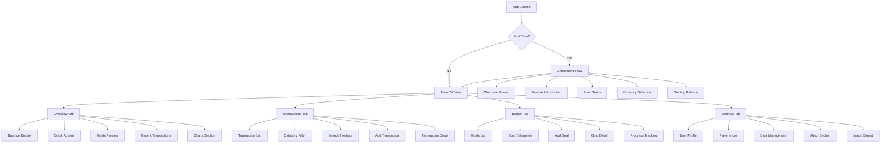

# Information Architecture (IA)

## Site Map / Screen Inventory

## Navigation Structure

**Primary Navigation:** Four-tab bottom navigation (Overview, Transactions, Budget, Settings) with consistent iconography and labels

**Secondary Navigation:** Contextual navigation within each tab using standard iOS navigation patterns (NavigationStack, sheets, alerts)

**Breadcrumb Strategy:** Not applicable for mobile app - use clear page titles and back navigation
