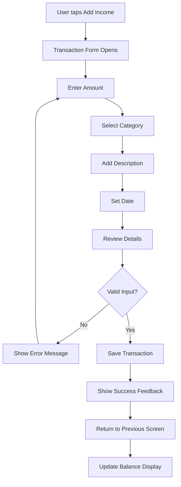
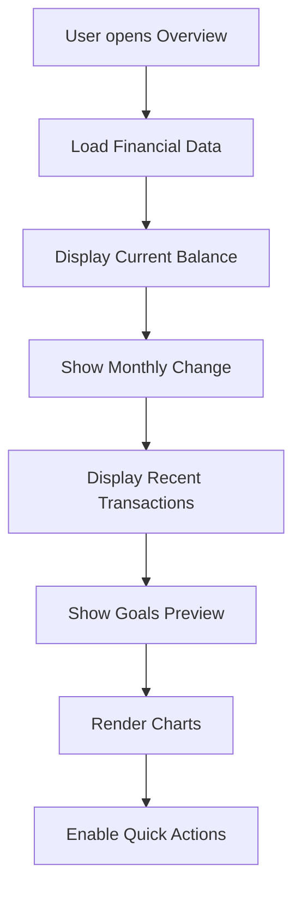
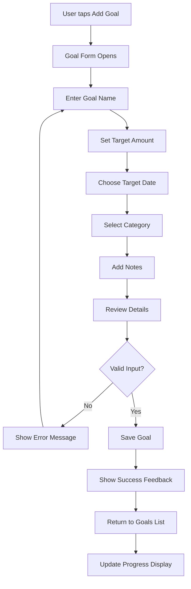

# User Flows

## Flow 1: Add Income Transaction

**User Goal:** Quickly add an income transaction to track money received

**Entry Points:** Overview tab "Add Income" button, Transactions tab "+" button

**Success Criteria:** Transaction appears in list with correct amount, category, and date

### Flow Diagram

### Edge Cases & Error Handling
- **Invalid Amount**: Show error message "Please enter a valid amount"
- **Empty Description**: Auto-generate description from category
- **Network Error**: Show retry option with offline capability
- **Duplicate Transaction**: Warn user about potential duplicate

**Notes:** Form uses modal presentation with clear validation feedback

## Flow 2: View Financial Overview

**User Goal:** Get quick understanding of current financial status

**Entry Points:** App launch, Overview tab selection, widget tap

**Success Criteria:** User sees current balance, recent activity, and goal progress

### Flow Diagram

### Edge Cases & Error Handling
- **No Data**: Show empty state with onboarding prompts
- **Loading Error**: Show retry button with error message
- **Slow Performance**: Show loading indicators for charts

**Notes:** All data loads asynchronously with progressive disclosure

## Flow 3: Create Savings Goal

**User Goal:** Set up a new savings goal with target amount and timeline

**Entry Points:** Budget tab "+" button, Overview tab "See All Goals" button

**Success Criteria:** Goal appears in list with progress tracking enabled

### Flow Diagram

### Edge Cases & Error Handling
- **Invalid Date**: Show error "Target date must be in the future"
- **Invalid Amount**: Show error "Target amount must be greater than $0"
- **Duplicate Name**: Suggest alternative name or allow edit

**Notes:** Form includes progress calculation preview
